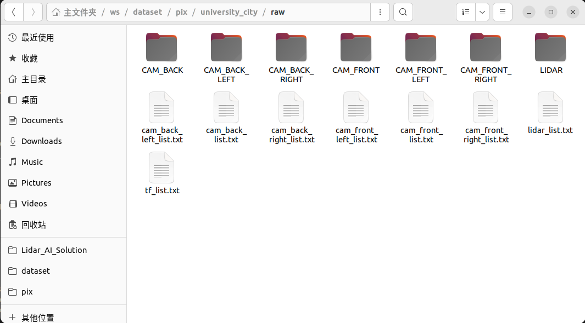
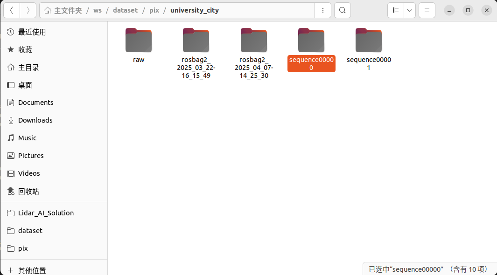
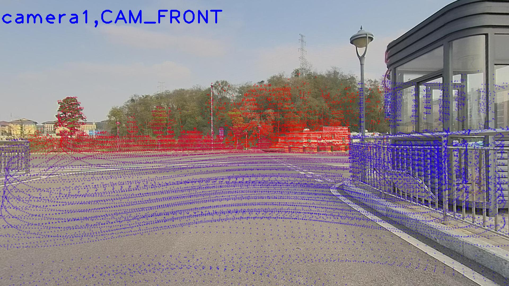

# 1.Envarienment
system: Ubuntu22.04
ROS: ros2_humble
python: pyton3

# 2.Download
create ros2 worksapce,
$ mkdir src & cd src
$ git clone xxxx

# 3.Compile
$ colcon build --packages-select bag_recorder_nodes_py

# 4.Run
parser bag files
There are two ways, one is using ROS2 synchronization method;and the other is to package the parsed data with sequqnce, provided that the parsed data is stored in advance.

## a:
### 1. start ros2 node 
$ source install/setup.bash
$ ros2 run bag_recorder_nodes_py synchronizer_recorder ${your_save_dir}
eg. ros2 run bag_recorder_nodes_py /home/pix/ws/dataset/pix/university_city

### 2. play ros bag
enter your data direcity
$ ros2 bag play ${your bag}
eg. ros2 bag play rosbag2_2025_03_22-16_15_49

## b:
### 1. start ros2 node
$ source install/setup.bash
$ ros2 run bag_recorder_nodes_py asynchronizer_recorder ${your_save_dir}
eg. ros2 run bag_recorder_nodes_py /home/pix/ws/dataset/pix/university_city

### 2. play ros bag
enter your data direcity
$ ros2 bag play ${your bag}
eg. ros2 bag play rosbag2_2025_03_22-16_15_49

### 3. package seqneuce
python3 sequence_package.py ${load_dir} ${save_dir}
eg. python3 sequence_package.py /home/pix/ws/dataset/pix/university_city /home/pix/ws/dataset/pix/university_city

### 4. the following as you see

# using pointcloud map to images (optional)
enter tools directory, exec command as the following:
$ python3 pc_2_image.py

# integrate pictures to video
enter tool directory, open the jpeg2video.bash file and modify the value of corresponding variable.
bash jpeg2video.bash
